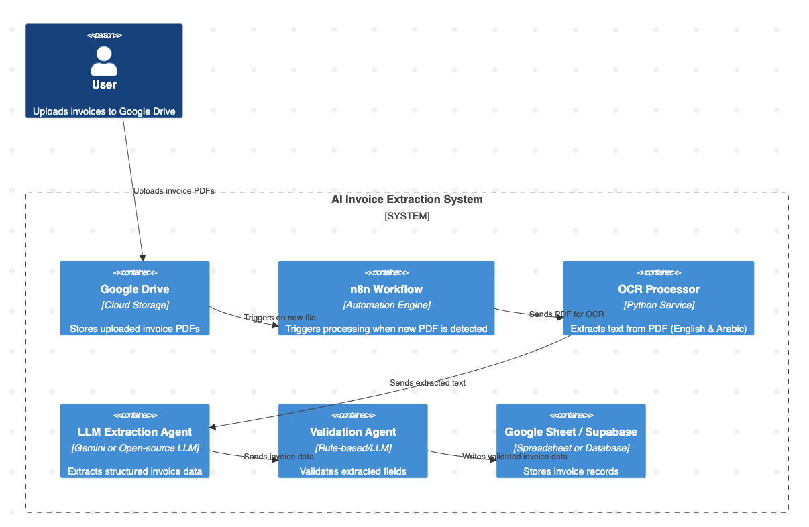

# Automated Invoice Extraction with n8n

This project was developed during my internship at **Fixed Solutions**.  
It is an **Automated Invoice Extraction system** built with [n8n](https://n8n.io/), designed to streamline the process of extracting and validating invoice data.  

---

## 🚀 Features:  
⿡ **Google Drive Trigger** – Monitors a specific folder for new invoices.  
⿢ **Download File** – Retrieves the uploaded PDF invoice.  
⿣ **Extract Text (Mistral OCR)** – Extracts text from invoices (supports both Arabic & English).  
⿤ **LLM (GPT-4o-mini)** – Transforms extracted text into structured key fields (e.g., invoice no., date, items, total).  
⿥ **Validation Step (JS Code)** – Cleans and validates extracted fields (e.g., phone, email, total > 0).  
⿦ **Google Sheets** – Stores structured and validated invoices for easy access & reporting.  

---

## 🛠️ Tech Stack
- **n8n** – Workflow automation
- **OCR** – For text extraction
- **LLMs** – For smart field extraction
- **JavaScript** – Custom validation rules

---

## 🛠️ Setup Instructions
1. Install [n8n](https://docs.n8n.io/).  
2. Import the workflow:  
   - Go to **n8n → Import Workflow → Upload JSON**.  
   - Select `Automated Invoice Extraction from Google Drive.json`.  
3. Add credentials for OCR/LLM.
4. Run the workflow.  
